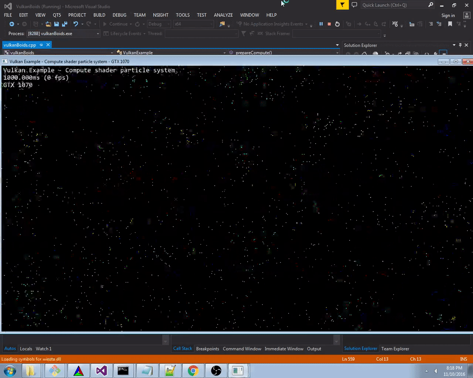

Vulkan Flocking: compute and shading in one pipeline!
======================

**University of Pennsylvania, CIS 565: GPU Programming and Architecture, Project 6**

* Gabriel Naghi
* Windows 7, Xeon E5-1630 @ 3.70GHz 32GB, GeForce GTX 1070 4095MB (SIG Lab MOR103-56)



##Vulkan Boids
Vulkan in Khronos Group's new explicit API powering the latest generation of games. One of the interesting new features of the Vulkan API is that it provides an interface to do compute work as well as graphics. Simultaneous graphics and compute workloads are becoming increasingly important; it is believed that this is one of the main advantages held by AMD GPUs over those of NVIDIA. 

In this project, I run display the power of side-by-side graphics and compute with a very simple Boid Flocking re-implementation. This is the same algorithm as that implemented in [Project 1](https://github.com/gabenaghi/Project1-CUDA-Flocking), except in 2D. 

##Food for Thought


####Why do you think Vulkan expects explicit descriptors for things like generating pipelines and commands?

Command buffers often live in pre-allocated GPU memory, which are allocated as command pools. These command pools can be highly optimized, depending on the type of commands that will live within. Vulkan thus expects explicit descriptors, so that the GPU can heavily optimize the memory they will live in. 

####Describe a situation besides flip-flop buffers in which you may need multiple descriptor sets to fit one descriptor layout.

Another scenario where you might need multiple descriptor sets with a single layout is if you have several data pools. For example, one might have several data pools from which he or she might want to draw data and, depending on the execution state, draw from any one of them. In this case, it is possible for them to define several descriptor sets and select whichever points to the data they deem necessary. 

####What are some problems to keep in mind when using multiple Vulkan queues?

When using multiple Vulkan queues, there are a couple problems to keep in mind. For one, since the queues are backed by physical GPU hardware, it is worth thinking about where precisely the queue is vs. where the queue is used. For example, if a queue is stored on one GPU and accessed from a second networked GPU, it might lead to poor performance. 

Additionally, one must beware of race conditions with the explicit threading capabilities provided by Vulkan. In particular, since it is possible to submit a single buffer for work in multiple queues, undefined outcomes will result if the buffers are not protected by some mutual exclusion mechanism. 

####What is one advantage of using compute commands that can share data with a rendering pipeline?

One huge advantage of compute commands sharing data with rendering pipelines is locality. Assuming the compiler and/or scheduler is intelligent enough, data should nearly always be local to any program which is executing on it, accelerating memory access and mitigating bandwidth bottlenecking. 

## Bloopers

It seems that I either did not learn my lesson or otherwise neglected to correct some aspect of my flocking algorithm from Project 1. I again created the black-hole boids that sucked in every other boid in some event horizon. Watch the video black-hole-boids.flv in the img/ directory to see what that looked like. 

### Credits

* [Vulkan examples and demos](https://github.com/SaschaWillems/Vulkan) by [@SaschaWillems](https://github.com/SaschaWillems)
